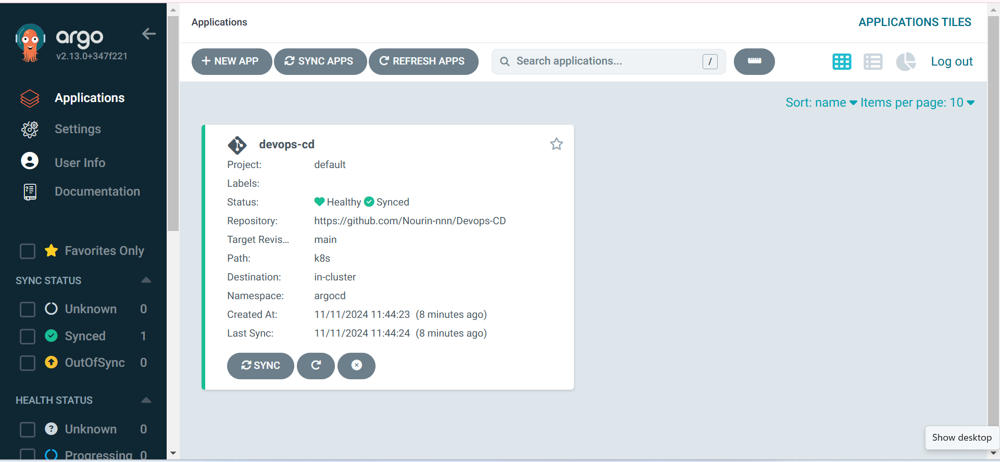
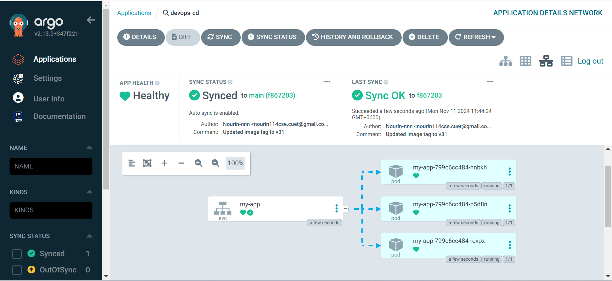

# DevOps CD Repository

This repository automates the Continuous Deployment (CD) for the `my-app` Kubernetes application. It works in tandem with the [Devops-CI](https://github.com/Nourin-nnn/Devops-CI) repository, which triggers this CD pipeline whenever a new Docker image is built, tested, and pushed. The CD pipeline then updates the Kubernetes deployment to ensure `my-app` always runs the latest version.

## Key Features

- **Automatic Docker Image Update**: Modifies the Kubernetes deployment file (`k8s/deployment.yaml`) with the latest Docker image tag from [Devops-CI](https://github.com/Nourin-nnn/Devops-CI).
- **GitOps with ArgoCD**: Utilizes ArgoCD to monitor changes in this repository and redeploy `my-app` automatically upon updates.

## Workflow Steps

1. **Triggered by Devops-CI Repository**: When the [Devops-CI](https://github.com/Nourin-nnn/Devops-CI) pipeline updates the Docker image, this CD workflow is triggered.
2. **Update Kubernetes Deployment**: The `k8s/deployment.yaml` file is modified with the new image tag, ensuring the latest version is deployed.
3. **Commit and Push Changes**: The updated deployment file is committed and pushed to the main branch.
4. **ArgoCD Sync**: ArgoCD detects the changes in this repository and automatically redeploys `my-app` with the new image version in Kubernetes.

## ArgoCD Dashboard

Here are screenshots showing the ArgoCD deployment status and synchronization of `my-app`.

### ArgoCD Application View

### ArgoCD Sync Status

These screenshots illustrate the successful deployment and health status after updates from the [Devops-CI](https://github.com/Nourin-nnn/Devops-CI) repository.

## Repository Structure

- **`k8s/deployment.yaml`**: Kubernetes deployment configuration, automatically updated with new Docker image releases.
- **`k8s/service.yaml`**: Kubernetes service configuration, exposing the `my-app` application on the cluster.
